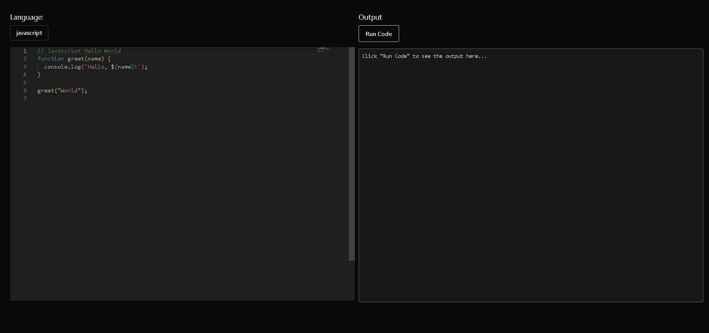

# Online Code Editor

A modern, web-based code editor that allows you to write and execute code in multiple programming languages directly in your browser.



## Features

- 🚀 **Multi-Language Support**: Write and execute code in JavaScript, TypeScript, Python, Java, and PHP
- 🎨 **Monaco Editor**: Powered by the same editor that powers VS Code
- 🌙 **Dark Theme**: Easy on the eyes with a sleek dark mode interface
- ⚡ **Real-time Execution**: Run your code instantly with the Piston API
- 📝 **Code Snippets**: Pre-loaded examples for each supported language
- 🎯 **Syntax Highlighting**: Language-specific syntax highlighting for better readability

## Tech Stack

- **Frontend**: React 19
- **UI Components**: Chakra UI v3
- **Code Editor**: Monaco Editor (via @monaco-editor/react)
- **Code Execution**: Piston API
- **HTTP Client**: Axios
- **Build Tool**: Vite
- **Language**: JavaScript

## Supported Languages

- JavaScript (18.15.0)
- TypeScript (5.0.3)
- Python (3.10.0)
- Java (15.0.2)
- PHP (8.2.3)

## Usage

1. **Select a Language**: Choose your programming language from the dropdown menu
2. **Write Code**: Use the Monaco editor on the left to write your code
3. **Run Code**: Click the "Run Code" button to execute your code
4. **View Output**: See the execution results in the output panel on the right

## Project Structure

```
CodeEditor/
├── public/
├── src/
│   ├── components/
│   │   ├── CodeEditor.jsx     # Main editor component
│   │   ├── CodeOutPut.jsx     # Output display component
│   │   └── LanguageSelector.jsx # Language selection dropdown
│   ├── assets/
│   ├── api.js                 # API calls to Piston
│   ├── constants.js           # Language configs and code snippets
│   ├── theme.js               # Chakra UI theme configuration
│   ├── App.jsx                # Root component
│   ├── main.jsx               # Entry point
│   └── index.css              # Global styles
├── index.html
├── package.json
├── vite.config.js
└── README.md
```

## API

This project uses the [Piston API](https://github.com/engineer-man/piston) for code execution. Piston is a high-performance code execution engine that supports multiple programming languages.

## Acknowledgments

- [Monaco Editor](https://microsoft.github.io/monaco-editor/) - The code editor
- [Piston API](https://github.com/engineer-man/piston) - Code execution engine
- [Chakra UI](https://chakra-ui.com/) - Component library
- [Vite](https://vitejs.dev/) - Build tool